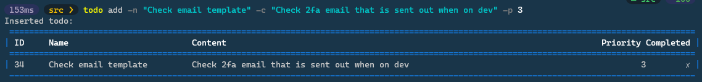
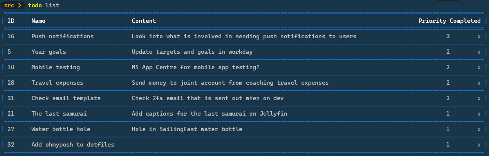
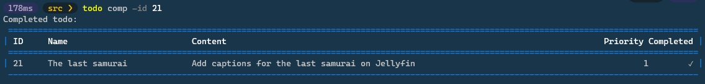
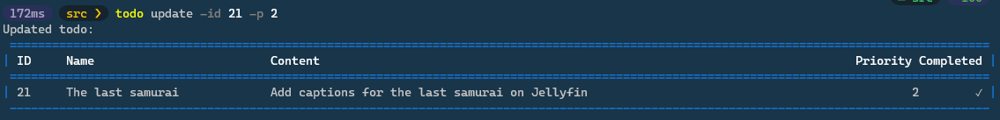
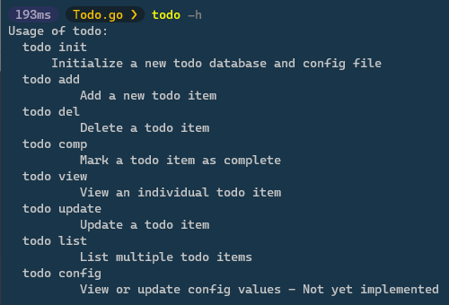
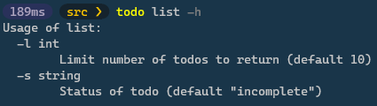

# Todo.go

Todo app built in Go using an sqlite db.

**Still in development**

## Usage

1. Create a new database
  `todo init`
2. List all todos
  `todo list`
3. Add a new todo
  `todo add -n "<Name of todo>" -c "<Content of todo>" -p "<Priority {1=Low,2,3=High}>"`
  Only name is required.
4. Complete a todo
  `todo comp -id <Id of todo>`
5. Delete a todo
  `todo del -id <Id of todo>`
  
  
## Install

1. Install go
2. Clone into a folder
  * `mkdir todo`
  * `cd todo`  
  * `make build` <- Creates an executable in `/todo/bin/todo.exe`. Add this to path to use anywhere
  
## Example

1. Add `todo.exe` to path
2. Set up sqlite database and config 
```
todo init
```
4. Create a todo
```
todo add -n "<name>" -c "<content>" -p <priority>
```

4. List all todos
```
todo list (Optional -l <number of retuns>, -s <status "incomplete"|"complete"|"all">) 
```

5. Complete a todo
```
todo comp -id <id>
```

6. Update a todo
```
todo update -id <id> (Optional -n "<name>" -c "<content>" -p <priority>)
```


Get stuck? Check the help

```
todo -h
```



or 

```
todo list -h
```


